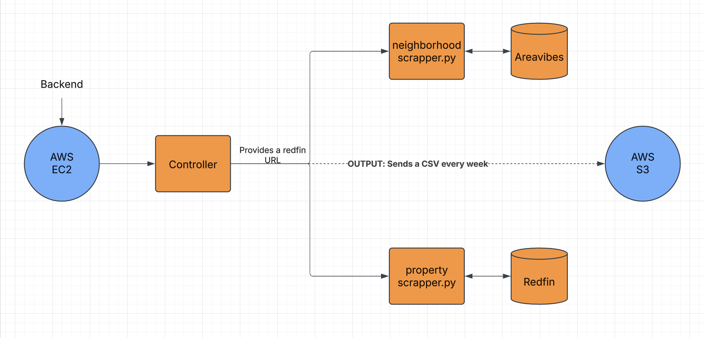

# Real Estate Web Scraper

## Overview
This repository contains a script that connects to an EC2 instance and runs once a week to scrape real estate data from specified URLs. The extracted data is saved into a CSV file for further analysis.

## Features
- Scrapes real estate listing details including building name, address, room details, amenities, and neighborhood information.
- Handles request rate limiting to avoid being blocked.
- Utilizes Selenium for dynamic content extraction.
- Gathers additional neighborhood data using `get_neighboorhood_info`.
- Saves the scraped data into a CSV file for easy analysis.

## Output
- The extracted data is stored as `real_estate_data.csv`.
- The script uploads the CSV file to an S3 bucket after processing.

## Logging
- Logs are stored in `scraper.log` to track the execution and debugging.

## Error Handling
- The script retries on failures and logs errors for debugging.
- Ensures graceful handling of missing data and connectivity issues.

## Progress
- **Phase 1:** Successfully implemented web scraping functions using BeautifulSoup and Selenium.
- **Phase 2:** Integrated AWS S3 for data storage.
- **Phase 3:** Added logging and error handling mechanisms.
- **Phase 4:** Deployed on EC2 and scheduled weekly execution.
- **Phase 5:** Validated output consistency and improved request handling.

## Backend Process
1. **Scraping Data:**
   - `retrieve_redfin.py` extracts property details such as name, address, room configurations, and pricing.
   - `retrieve_neighboorhood.py` retrieves neighborhood information, including livability scores and nearby amenities.
2. **Data Storage & Processing:**
   - Extracted data is compiled and structured into a CSV file.
   - The CSV file is then uploaded to an AWS S3 bucket for storage and further analysis.
3. **Automation & Scheduling:**
   - The script runs weekly on an EC2 instance via a cron job to ensure updated real estate data is collected.

## Repository Structure
- `scraper.py` - Main script for scraping real estate data.
- `retrieve_redfin.py` - Extracts real estate data from Redfin.
- `retrieve_neighboorhood.py` - Fetches neighborhood-related data.
- `S3_manager.py` - Handles AWS S3 operations including uploading and retrieving files.
- `config.ini` - Configuration file for AWS and script settings.
- `requirements.txt` - List of dependencies for setting up the environment.
- `scraper.log` - Log file for debugging and execution tracking.
- `real_estate_data.csv` - Output CSV file containing scraped data.

## Deployment
- The script is deployed on an AWS EC2 instance.
- A cron job schedules weekly execution.

## Diagram
Below is a visual representation of the scraper’s workflow:



# Apartment Listing Example

```json
{
    "Building Name": "The Example Tower",
    "Address": "123 Example Street, Sample City, ST 00000",
    "Room Info": {
        "Room Title": "1x1 Deluxe",
        "Bed/Baths": "1 Bed / 1 Bath",
        "Price": "$1200",
        "Sqft": "750",
        "Availability": "Now"
    },
    "Amenities": {
        "Cats Allowed": true,
        "Dogs Allowed": false,
        "Parking Fee": "$100"
    },
    "Neighborhood": {
        "Livability": "85/100",
        "Commute": "A",
        "Schools": "A-",
        ...
    }
}
```